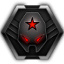

# Galactic War Overhaul Readme

This mod works with Planetary Annihilation: TITANS only. It changes the following elements of Galactic War:

- Restore faction personalities:
  - Legonis Machina: tank
  - Foundation: air/naval
  - Synchronous: bot
  - Revenants: orbital
- Customise each enemy/Sub Commander:
  - Unique model
  - Unique personality
  - Unique colour
  - Fight according to their faction's preferred style
- Nine new difficulties suitable for anyone from a new player to a veteran of the game
- Reduced Sub Commander effectiveness
- Adds the possibility of multiple factions in a system and an FFA occurring
- Adds the possibility of an allied Commander joining you in a system
- Adds support for shared army enemies
- Bosses are distinctly more difficult than the surrounding systems
- Added planetary intelligence to allow you to make meaningful decisions on the galactic map
- Randomised spawn assignments so maps remain fresh on replay
- Uses all game modes:
  - Bounty mode
  - Land anywhere
  - Sudden death
  - Eradication
- Option to give yourself more starting neutral systems
- The AI uses tech card buffs
- Guaranteed loadout to unlock every war, defended by The Guardians who turn your own technology against you
- 17 new loadouts
- Unlocks Galactic War's biggest planetary systems
- Adds the classic Galactic War systems in addition to the TITANS systems
- Adds a new faction
- Fixes all the errors in the tech cards
- Over 150 new tech cards
- Every feature is supported in co-op, including per-player loadouts and per-player tech
- Three AI brains, selectable separately for your enemies and your allies:
  - Titans: the base game AI
  - Queller: a greater challenge at the cost of performance
  - Penchant: increased personality

Be sure to check out my guide on [adding more maps to Galactic War](https://planetaryannihilation.com/guides/galactic-war-difficulty-and-adding-more-maps/) to enhance the experience further.

## Installation

You should download and install this mod via the Planetary Annihilation: TITANS in-game [Community Mods](https://steamcommunity.com/sharedfiles/filedetails/?id=1417396826).

## Discussion

Join the [Planetary Annihilation official Discord](https://discord.gg/pa).

## In Action

## Difficulty

Sub Commanders are not impacted by difficulty. Difficulty is separate from the Game Options below, which can be combined with any difficulty level.

 **Beginner**: you've completed the tutorial and are new to the game.

 **Casual**: you've some PA experience under your belt.

 **Iron**: you've overcome your turtle instincts.

 **Bronze**: you've beaten vanilla Galactic War.

 **Silver**: you've beaten the skirmish AI.

 **Gold**: you've beaten the Queller AI.

 **Platinum**: one enemy Commander is no longer a worthy challenge.

 **Diamond**: your loadouts are too powerful.

 **Uber**: you're a Galactic War master ready for the ultimate challenge.

 **Custom**: you want to create your own challenge.

## Game Options

Chosen when you create a war, from the Game Options panel, and applied for its duration.

- **Hardcore**: permanent death. No restarts when your Commander is annihilated.
- **Faction Scaling**: the number of enemy factions is adjusted for the galaxy's size.
- **System Scaling**: system size is determined by how far into the galaxy you are.
- **Easy Systems**: use smaller, mostly single planet systems. Hidden when Shared Systems for Galactic War is active.
- **Large Planets**: encounter large planets and systems much sooner.
- **Easier Start**: four neutral systems to plunder at the start instead of the usual two.
- **System Lore**: display the original pre-release Galactic War lore in the Planetary Intelligence panel.
- **Static Tech**: the Available Tech in a system never changes.

## Planetary Intelligence

Each system will display the following information:

- **Surface Area**: the total surface size of all planets, excluding gas giants.
- **Threat Level**: based on the total eco score of all enemies, reduced if an ally is present.
- **Available Tech**: the card which will be offered as part of the first draw.
- **AI Tech**: the buffs held by the AI, applied to its Commanders and the units its faction prefers.
- **Game Modifiers**: the modes active in this system.
  - **Bounties**: gain an eco bonus for each army destroyed. Enemies gain these too.
  - **Land Anywhere**: you can land anywhere on any starting planet.
  - **Sudden Death**: the defeat of a single army on a team leads to the defeat of the entire team. This includes Sub Commanders.
  - **Eradicate**: all units of specific types must be eradicated.
- **Factions**: one heading per faction present, listing its Commanders. More than one enemy faction means the system is a FFA and they will fight against you, each other, and the primary faction. An allied faction is marked ALLY.
- **Personality**: the playstyle adopted by the Commander. Some are better than others and it's up to you to figure out which.

### AI Tech

The panel names the effect, not the tech. Each one is the AI's equivalent of a card you can hold yourself:

- **Build faster**: Efficiency Tech
- **Combat units enhanced**: Combat Tech, which also carries Ammunition and Armour Tech
- **Costs decreased**: Fabrication Tech
- **Damage increased**: Ammunition Tech
- **Factory cooldown decreased**: Cooldown Tech
- **Health increased**: Armour Tech
- **Speed increased**: Engine Tech

These buffs are applied to commanders on a per-faction basis:

- **Legonis Machina**: vehicle units and factories
- **Foundation**: air and naval units and factories
- **Synchronous**: bot units and factories
- **Revenants**: orbital units, orbital and superweapon structures
- **Cluster**: all structures

## Compatible Loadouts & Tech Cards

To create a GWO compatible loadout or tech card, please see the [New GW Cards repository](https://github.com/Quitch/New-GW-Cards/).

## Contributing

Changes are welcome. See [CONTRIBUTING.md](./CONTRIBUTING.md) for the conventions and the checks to run before submitting.

## FAQ

**Q. Why am I not seeing the latest changes in my war?**

Many changes will only apply to new wars.

**Q. Why am I seeing multiple Commanders for a single enemy army?**

Both bosses and FFA factions will use Shared Armies to allow for multiple Commanders within a single army. This provides them with more additional build power and more lives. It allows them to connect multiple planets very quickly.

**Q. Why aren't awarded bounties showing on the player list?**

Galactic War hides eco modifiers from the player list. The bounties are still being awarded. If you gain one it will show below your eco bar.

## Report a Bug

Open a [new issue](https://github.com/Quitch/GW-AI-Overhaul/issues) on the GitHub repository.

### Known issues

- Some users have reported instances of the sim freezing while the UI continues to respond. The host should go to Settings - Server and set Local Server Multi-Threading to OFF prior to hosting.
- Enemy Cluster Worker and Security commanders will use the Angel and Colonel icons - this is a PA bug not a GWO one.

## Recommended mods

- Shared Systems for galactic war
- AI Chat
- AI Personality Names

## Incompatible mods

- Aurora Artillery
- Challenge Levels for galactic war
- Enemy ramp for galactic war
- Galactic War Unique Loadouts
- More Pew Pew
- Section of Foreign Intelligence for galactic war
- Selection and combat grouping mods e.g. Air Scout Select
- Client mod which modifies unit files and is incompatible with PA 116982 or later. Disable any unit, selection, FX, or faction mod which hasn't been updated since at least 12 June 2023.

## Thanks to

- wondible, who continues to be amazing with his JavaScript support and for his mod Section of Foreign Intelligence for Galactic War, a modified version of which is included within this mod
- PA Inc, for including official translations for the mod and assistance in integrating AI modifications
- nemuneko, whose Unique Commander Loadouts for Galactic War are included in this mod
- WPMarshall, for the Cluster faction logo and home system
- trialq, whose discontinued Galactic War Loadouts mod has been partially included in this mod
- Tristan, who created the casual, iron, and diamond icons
- tatapstar for the mod's icon
- Diruslupus, for their invaluable assistance in getting co-op support implemented

## License

[Creative Commons Attribution 4.0 International](./LICENSE).
